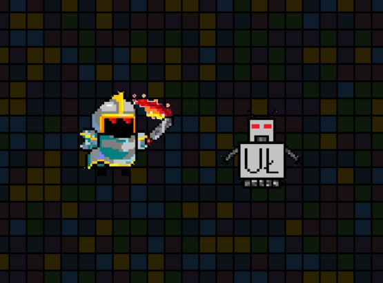

# Knight
This is my test game for understanding basics of SDL and game development on C.
## Table on contents
* [General info](#general-info)
* [Technologies](#technologies)
* [Setup](#setup)

## General info
I wanted to write some game using only C, so this is actually my first ever try. I decided to use SDL framework and CLion as compiler. It was pretty hard to understand how to use SDL with CMakefiles, but, thanks to Timur (iltam sumra rashid), i could do it! So, the game shows as some little knight, that should kill some bots from UL. In future I am planning to add levels, different bots, different knight and really much other stuff! 

The main technology implemented in this game is changing frames when you press the keys. I rendered all the frames separately, so that moving, hitting and all other actions of the characters turned out smooth and pleasant (relatively).
Here's an example of how I implemented frame loading, where fileNames is names of our photos (f.e. photo1.jpg), arraySize is a numbers of our frames and textureArray is our storage: 
```
int loadTextureArray(SDL_Renderer* renderer, const char** fileNames, int arraySize, SDL_Texture** textureArray)
{
    for(int i = 0; i < arraySize; i++)
    {
        SDL_Surface* surface = SDL_LoadBMP(fileNames[i]);
        if (surface == NULL)
        {
            printf("Error loading image %d: %s\n", i, SDL_GetError());
            SDL_DestroyRenderer(renderer);
            return 1;
        }
        textureArray[i] = SDL_CreateTextureFromSurface(renderer, surface);
        SDL_FreeSurface(surface);
        if (textureArray[i] == NULL)
        {
            printf("Error creating texture for image %d: %s\n", i, SDL_GetError());
            SDL_DestroyRenderer(renderer);
            return 1;
        }
    }
    return 0;
}
```
Here is my little boy:


    
